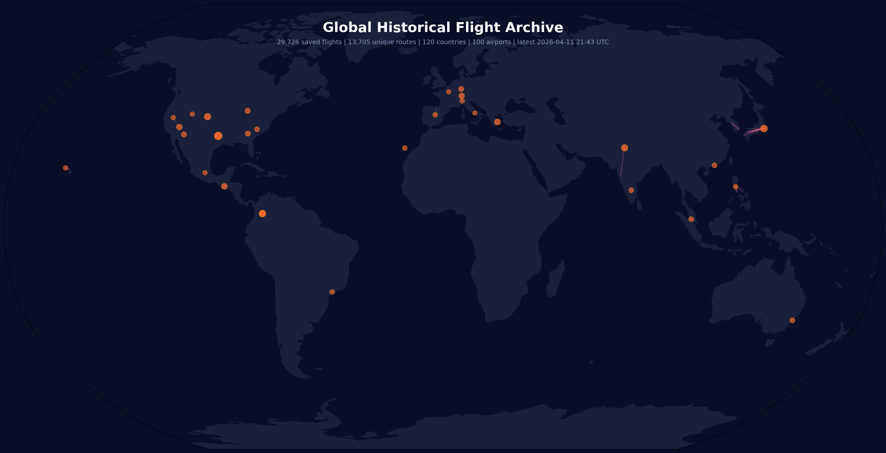
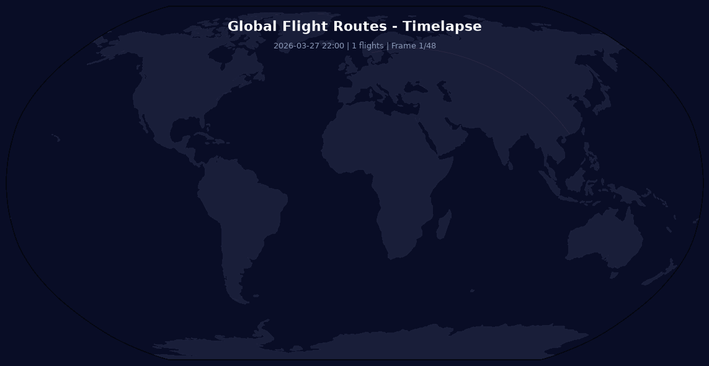

# Global Air Traffic Tracker

## About

Historical archive of saved air traffic routes collected from the [OpenSky Network](https://opensky-network.org/) API. This repository keeps appending completed flights to `data/flights/` and rebuilds the visuals from the full archive.

**Data Source:** Saved route files in `data/flights/` (originally fetched from OpenSky `/flights/all`)

**Update Frequency:** Every 5 minutes via GitHub Actions

**How it works:**
- Fetches recently completed routes from OpenSky
- Saves each route as a JSON file in `data/flights/`
- Rebuilds aggregate statistics from all saved historical routes
- Generates a historical route map and archive summary
- Generates daily reports, weekly leaderboards, and timelapse GIFs

## Route Timelapse

## Archive Snapshot

**Latest saved flight:** 2026-04-11 21:43:54 UTC
**Archive range:** 2026-03-27 22:00:26 UTC to 2026-04-11 21:43:54 UTC

- **29,726** saved flights
- **13,705** unique routes
- **120** countries touched by saved routes
- **100** airports in the archive
- **50** airlines identified
- **29,726** saved routes in the archive
- **1h 14m** average flight duration

### Carbon Footprint Estimate

- **362,311.7 tonnes** estimated CO2 emissions
- **21,003,579 km** total distance flown
- **843 km** average flight distance
*Based on ICAO avg: 115g CO2/passenger-km, ~150 passengers*

## Top Airlines

| # | Airline | Aircraft |
|---:|---------|--------:|
| 1 | Ryanair | 1225 |
| 2 | SkyWest Airlines | 1218 |
| 3 | IndiGo | 767 |
| 4 | EJA | 518 |
| 5 | American Airlines | 515 |
| 6 | Southwest Airlines | 432 |
| 7 | ENY | 402 |
| 8 | Lufthansa | 359 |
| 9 | AXM | 314 |
| 10 | Vueling | 306 |
| 11 | LATAM Airlines | 292 |
| 12 | All Nippon Airways | 263 |
| 13 | AZU | 261 |
| 14 | QLK | 254 |
| 15 | Delta Air Lines | 245 |
| 16 | LXJ | 238 |
| 17 | Swiss International | 217 |
| 18 | Alaska Airlines | 199 |
| 19 | easyJet | 193 |
| 20 | EJU | 192 |
| 21 | VIV | 192 |
| 22 | Japan Airlines | 190 |
| 23 | WIF | 187 |
| 24 | AEE | 186 |
| 25 | United Airlines | 179 |
| 26 | EDV | 175 |
| 27 | Avianca | 165 |
| 28 | GLO | 158 |
| 29 | JetBlue | 157 |
| 30 | Air France | 154 |

## Top Countries (by route endpoints)

| # | Country | Flights |
|---:|---------|--------:|
| 1 | 🇺🇸 US | 23550 |
| 2 | 🇮🇳 IN | 2358 |
| 3 | 🇪🇸 ES | 2210 |
| 4 | 🇦🇺 AU | 2089 |
| 5 | 🇧🇷 BR | 1720 |
| 6 | 🇯🇵 JP | 1612 |
| 7 | 🇮🇹 IT | 1529 |
| 8 | 🇨🇴 CO | 1508 |
| 9 | 🇩🇪 DE | 1490 |
| 10 | 🇨🇦 CA | 1460 |
| 11 | 🇬🇧 GB | 1199 |
| 12 | 🇫🇷 FR | 1097 |
| 13 | 🇲🇽 MX | 958 |
| 14 | 🇬🇷 GR | 843 |
| 15 | 🇨🇭 CH | 840 |
| 16 | 🇲🇾 MY | 752 |
| 17 | 🇳🇿 NZ | 640 |
| 18 | 🇳🇴 NO | 632 |
| 19 | 🇿🇦 ZA | 609 |
| 20 | 🇬🇹 GT | 551 |
| 21 | 🇵🇭 PH | 547 |
| 22 | 🇹🇷 TR | 537 |
| 23 | 🇹🇭 TH | 532 |
| 24 | 🇰🇷 KR | 498 |
| 25 | 🇵🇱 PL | 450 |
| 26 | 🇲🇦 MA | 372 |
| 27 | 🇧🇸 BS | 317 |
| 28 | 🇲🇪 ME | 298 |
| 29 | 🇳🇱 NL | 285 |
| 30 | 🇮🇩 ID | 278 |

## Busiest Airports (departures + arrivals across archive)

| # | Airport | City | Country | Flights |
|---:|---------|------|---------|--------:|
| 1 | Dallas-Fort Worth International Airport |  | US | 709 |
| 2 | Tokyo International Airport |  | JP | 540 |
| 3 | El Dorado International Airport |  | CO | 536 |
| 4 | Denver International Airport |  | US | 506 |
| 5 | Indira Gandhi International Airport |  | IN | 492 |
| 6 | Eleftherios Venizelos International Airport |  | GR | 412 |
| 7 | La Aurora Airport |  | GT | 393 |
| 8 | Harry Reid International Airport |  | US | 383 |
| 9 | Guaymaral Airport |  | CO | 359 |
| 10 | Zurich Airport |  | CH | 358 |
| 11 | Phoenix Sky Harbor International Airport |  | US | 310 |
| 12 | Hartsfield/Jackson Atlanta International Airport |  | US | 309 |
| 13 | Chicago O'Hare International Airport |  | US | 308 |
| 14 | Frankfurt am Main International Airport |  | DE | 301 |
| 15 | Sydney Kingsford Smith International Airport |  | AU | 290 |
| 16 | Kuala Lumpur International Airport |  | MY | 282 |
| 17 | Macau International Airport |  | MO | 274 |
| 18 | Bengaluru International Airport |  | IN | 268 |
| 19 | Charlotte/Douglas International Airport |  | US | 267 |
| 20 | Madrid Barajas International Airport |  | ES | 263 |
| 21 | Tenerife Norte Airport |  | ES | 262 |
| 22 | Ninoy Aquino International Airport |  | PH | 251 |
| 23 | Congonhas Airport |  | BR | 251 |
| 24 | Malpensa International Airport |  | IT | 238 |
| 25 | Atizapan De Zaragoza Airport |  | MX | 230 |
| 26 | Daniel K Inouye International Airport |  | US | 229 |
| 27 | Salt Lake City International Airport |  | US | 228 |
| 28 | Reno/Tahoe International Airport |  | US | 225 |
| 29 | Charles de Gaulle International Airport |  | FR | 211 |
| 30 | Capua Airport |  | IT | 205 |
| 31 | Guarulhos - Governador Andre Franco Montoro International Airport |  | BR | 205 |
| 32 | John Paul II International Airport Kraków-Balice Airport |  | PL | 200 |
| 33 | Miami International Airport |  | US | 200 |
| 34 | General Edward Lawrence Logan International Airport |  | US | 199 |
| 35 | Netaji Subhash Chandra Bose International Airport |  | IN | 199 |
| 36 | O. R. Tambo International Airport |  | ZA | 194 |
| 37 | Vitoria/Foronda Airport |  | ES | 193 |
| 38 | Barcelona International Airport |  | ES | 189 |
| 39 | Seattle-Tacoma International Airport |  | US | 188 |
| 40 | Viracopos International Airport |  | BR | 182 |

## Top Routes (all saved history)

| # | From | To | Flights | Avg Duration | Distance | CO2 |
|---:|------|-----|--------:|------------:|--------:|----:|
| 1 | Tokyo International Airport (RJTT) | Iwakuni Marine Corps Air Station (RJOI) | 139 | 1h 8m | 706 km | 1,692.3 t |
| 2 | Guaymaral Airport (SKGY) | Guaymaral Airport (SKGY) | 139 | 26m | - | - |
| 3 | El Dorado International Airport (SKBO) | Perales Airport (SKIB) | 124 | 14m | 114 km | 243.2 t |
| 4 | Ninoy Aquino International Airport (RPLL) | Wasig Airport (RPVL) | 109 | 24m | 225 km | 422.9 t |
| 5 | Gimpo International Airport (RKSS) | G 802 Airport (RKD1) | 100 | 28m | 304 km | 524.2 t |
| 6 | Tokyo International Airport (RJTT) | Saga Airport (RJFS) | 86 | 1h 27m | 910 km | 1,349.5 t |
| 7 | La Aurora Airport (MGGT) | Coban Airport (MGCB) | 75 | 21m | 99 km | 128.5 t |
| 8 | Kuala Lumpur International Airport (WMKK) | Batu Pahat Airport (WMAB) | 74 | 19m | 165 km | 210.5 t |
| 9 | VGZR (VGZR) | Shah Amanat International Airport (VGEG) | 73 | 31m | - | - |
| 10 | La Aurora Airport (MGGT) | Copan Ruinas Airport (MHRU) | 69 | 27m | 152 km | 180.3 t |
| 11 | Indira Gandhi International Airport (VIDP) | Pune Airport (VAPO) | 67 | 1h 42m | 1,156 km | 1,336.6 t |
| 12 | Tokyo International Airport (RJTT) | Okayama Airport (RJOB) | 65 | 55m | 546 km | 612.0 t |
| 13 | La Aurora Airport (MGGT) | La Aurora Airport (MGGT) | 65 | 9m | - | - |
| 14 | Madrid Barajas International Airport (LEMD) | Vitoria/Foronda Airport (LEVT) | 63 | 27m | 275 km | 298.5 t |
| 15 | Tokyo International Airport (RJTT) | Hofu Airport (RJOF) | 62 | 1h 12m | 770 km | 823.6 t |
| 16 | Daniel K Inouye International Airport (PHNL) | Hana Airport (PHHN) | 58 | 16m | 206 km | 206.2 t |
| 17 | Ninoy Aquino International Airport (RPLL) | Moises R. Espinosa Airport (RPVJ) | 56 | 31m | 369 km | 356.5 t |
| 18 | Harry Reid International Airport (KLAS) | Reno/Tahoe International Airport (KRNO) | 55 | 52m | 556 km | 527.2 t |
| 19 | Daniel K Inouye International Airport (PHNL) | Upolu Airport (PHUP) | 53 | 21m | 244 km | 223.2 t |
| 20 | Tokyo International Airport (RJTT) | Tajima Airport (RJBT) | 53 | 46m | 452 km | 413.1 t |
| 21 | O. R. Tambo International Airport (FAOR) | Newcastle Airport (FANC) | 50 | 20m | 250 km | 216.0 t |
| 22 | El Dorado International Airport (SKBO) | Jose Celestino Mutis Airport (SKQU) | 48 | 13m | 99 km | 82.3 t |
| 23 | Don Mueang International Airport (VTBD) | Prachuap Airport (VTBP) | 47 | 23m | 252 km | 204.1 t |
| 24 | Indira Gandhi International Airport (VIDP) | Yongphulla Airport (VQ10) | 46 | 1h 42m | 1,423 km | 1,128.9 t |
| 25 | Eleftherios Venizelos International Airport (LGAV) | Paros Airport (LGPA) | 45 | 20m | 147 km | 113.9 t |
| 26 | Bodø Airport (ENBO) | Bodø Airport (ENBO) | 45 | 4m | - | - |
| 27 | Cancun International Airport (MMUN) | Atizapan De Zaragoza Airport (MMJC) | 45 | 1h 53m | 1,304 km | 1,012.4 t |
| 28 | Congonhas Airport (SBSP) | Destilaria Medasa Airport (SJNQ) | 42 | 1h 19m | 961 km | 696.2 t |
| 29 | El Dorado International Airport (SKBO) | Guaymaral Airport (SKGY) | 41 | 12m | 15 km | 10.8 t |
| 30 | Bergen Airport Flesland (ENBR) | Ørsta-Volda Airport Hovden (ENOV) | 39 | 26m | 215 km | 144.4 t |

## Recent Flights

| Callsign | Airline | From | To | Departure | Arrival | Duration |
|----------|---------|------|-----|-----------|---------|----------|
| N750GJ |  | Bob Maxwell Memorial Airfield (KOKB) | Bob Maxwell Memorial Airfield (KOKB) | 2026-04-11 21:20 UTC | 2026-04-11 21:43 UTC | 23m |
| N692DA |  | General Mariano Matamoros Airport (MMCB) | Hermanos Serdan International Airport (MMPB) | 2026-04-11 21:26 UTC | 2026-04-11 21:37 UTC | 11m |
| JNA132 | JNA | Kota Kinabalu International Airport (WBKK) | Incheon International Airport (RKSI) | 2026-04-11 16:52 UTC | 2026-04-11 21:37 UTC | 4h 45m |
| EVANS11 | EVA Air | Buckley Space Force Base Airport (KBKF) | Perry Park Airport (CO93) | 2026-04-11 20:57 UTC | 2026-04-11 21:33 UTC | 35m |
| N922AZ |  | Tucson International Airport (KTUS) | Phoenix Sky Harbor International Airport (KPHX) | 2026-04-11 21:02 UTC | 2026-04-11 21:32 UTC | 29m |
| N1126E |  | Palm Beach County Park Airport (KLNA) | Palm Beach County Park Airport (KLNA) | 2026-04-11 21:01 UTC | 2026-04-11 21:23 UTC | 22m |
| AIC314 | Air India | Indira Gandhi International Airport (VIDP) | Zhuhai Airport (ZGSD) | 2026-04-11 17:12 UTC | 2026-04-11 21:18 UTC | 4h 6m |
| TAM9425 | LATAM Airlines | Fazenda Pixoxo Airport (SDOX) | Fazenda Sao Joao Airport (SDKQ) | 2026-04-11 21:00 UTC | 2026-04-11 21:17 UTC | 16m |
| ERU495 | ERU | Daytona Beach International Airport (KDAB) | New Smyrna Beach Municipal (Jack Bolt Field) Airport (KEVB) | 2026-04-11 20:26 UTC | 2026-04-11 21:14 UTC | 47m |
| BPX212 | BPX | Daytona Beach International Airport (KDAB) | Skinners Wholesale Nursery Airport (16FD) | 2026-04-11 20:59 UTC | 2026-04-11 21:14 UTC | 14m |
| N513SK |  | Santa Barbara Municipal Airport (KSBA) | Tweed/New Haven Airport (KHVN) | 2026-04-11 16:34 UTC | 2026-04-11 21:12 UTC | 4h 37m |
| TGSUN | TGS | La Aurora Airport (MGGT) | La Aurora Airport (MGGT) | 2026-04-11 21:02 UTC | 2026-04-11 21:12 UTC | 10m |
| DLH9HC | Lufthansa | Frankfurt am Main International Airport (EDDF) | Weimar-Umpferstedt Airport (EDOU) | 2026-04-11 20:30 UTC | 2026-04-11 21:09 UTC | 39m |
| CCA940 | Air China | Leonardo Da Vinci (Fiumicino) International Airport (LIRF) | Smolensk North Airport (XUBS) | 2026-04-11 18:42 UTC | 2026-04-11 21:07 UTC | 2h 24m |
| N900KE |  | Dallas Executive Airport (KRBD) | Livingston Municipal Airport (K8A3) | 2026-04-11 19:41 UTC | 2026-04-11 21:04 UTC | 1h 23m |
| N227TF |  | Corona Municipal Airport (KAJO) | Hemet-Ryan Airport (KHMT) | 2026-04-11 20:39 UTC | 2026-04-11 21:03 UTC | 23m |
|  |  | Sebring Regional Airport (KSEF) | Sebring Regional Airport (KSEF) | 2026-04-11 21:01 UTC | 2026-04-11 21:03 UTC | 1m |
| SKW5516 | SkyWest Airlines | Chicago O'Hare International Airport (KORD) | 1PS4 (1PS4) | 2026-04-11 20:04 UTC | 2026-04-11 21:02 UTC | 57m |
| CPA640 | Cathay Pacific | Tribhuvan International Airport (VNKT) | Zhuhai Airport (ZGSD) | 2026-04-11 17:37 UTC | 2026-04-11 21:01 UTC | 3h 24m |
| SH245 |  | Collier/Pine Barren Airpark (FD89) | Skywest Airpark (62AL) | 2026-04-11 20:37 UTC | 2026-04-11 20:58 UTC | 21m |

---

