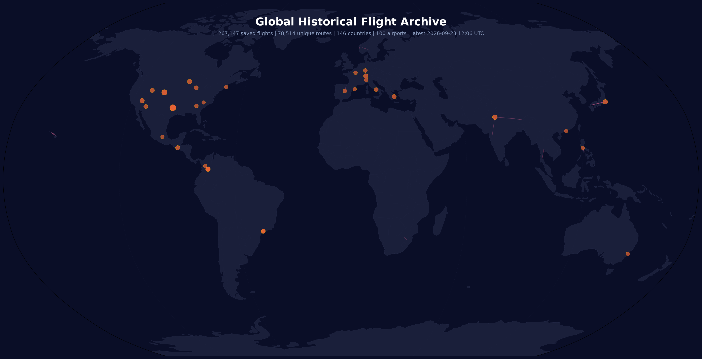
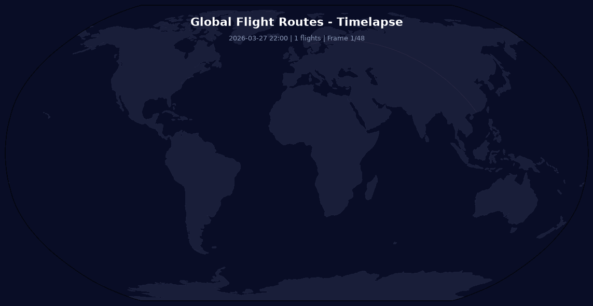

# Global Air Traffic Tracker

## About

Historical archive of saved air traffic routes collected from the [OpenSky Network](https://opensky-network.org/) API. This repository keeps appending completed flights to `data/flights/` and rebuilds the visuals from the full archive.

**Data Source:** Saved route files in `data/flights/` (originally fetched from OpenSky `/flights/all`)

**Update Frequency:** Every 5 minutes via GitHub Actions

**How it works:**
- Fetches recently completed routes from OpenSky
- Saves each route as a JSON file in `data/flights/`
- Rebuilds aggregate statistics from all saved historical routes
- Generates a historical route map and archive summary
- Generates daily reports, weekly leaderboards, and timelapse GIFs

## Route Timelapse

## Archive Snapshot

**Latest saved flight:** 2026-08-26 05:22:29 UTC
**Archive range:** 2026-03-27 22:00:26 UTC to 2026-08-26 05:22:29 UTC

- **237,515** saved flights
- **72,393** unique routes
- **145** countries touched by saved routes
- **100** airports in the archive
- **50** airlines identified
- **237,515** saved routes in the archive
- **1h 14m** average flight duration

### Carbon Footprint Estimate

- **2,859,760.3 tonnes** estimated CO2 emissions
- **165,783,207 km** total distance flown
- **856 km** average flight distance
*Based on ICAO avg: 115g CO2/passenger-km, ~150 passengers*

## Top Airlines

| # | Airline | Aircraft |
|---:|---------|--------:|
| 1 | Ryanair | 9503 |
| 2 | SkyWest Airlines | 8391 |
| 3 | EJA | 4617 |
| 4 | IndiGo | 4001 |
| 5 | American Airlines | 3855 |
| 6 | Southwest Airlines | 3613 |
| 7 | Delta Air Lines | 3033 |
| 8 | ENY | 2881 |
| 9 | LATAM Airlines | 2282 |
| 10 | AZU | 2216 |
| 11 | Vueling | 2028 |
| 12 | Lufthansa | 1920 |
| 13 | WIF | 1883 |
| 14 | LXJ | 1852 |
| 15 | easyJet | 1657 |
| 16 | Swiss International | 1588 |
| 17 | AXM | 1585 |
| 18 | EJU | 1520 |
| 19 | QLK | 1517 |
| 20 | United Airlines | 1505 |
| 21 | Alaska Airlines | 1428 |
| 22 | All Nippon Airways | 1414 |
| 23 | GLO | 1329 |
| 24 | WMT | 1324 |
| 25 | VIV | 1312 |
| 26 | PGT | 1296 |
| 27 | Air France | 1284 |
| 28 | Wizz Air | 1268 |
| 29 | JetBlue | 1180 |
| 30 | AEE | 1176 |

## Top Countries (by route endpoints)

| # | Country | Flights |
|---:|---------|--------:|
| 1 | 🇺🇸 US | 197391 |
| 2 | 🇪🇸 ES | 15216 |
| 3 | 🇧🇷 BR | 13883 |
| 4 | 🇦🇺 AU | 13489 |
| 5 | 🇨🇦 CA | 13171 |
| 6 | 🇮🇹 IT | 12932 |
| 7 | 🇮🇳 IN | 12470 |
| 8 | 🇩🇪 DE | 11670 |
| 9 | 🇬🇧 GB | 11180 |
| 10 | 🇨🇴 CO | 10122 |
| 11 | 🇯🇵 JP | 9607 |
| 12 | 🇫🇷 FR | 9504 |
| 13 | 🇹🇷 TR | 7050 |
| 14 | 🇬🇷 GR | 6983 |
| 15 | 🇲🇽 MX | 6602 |
| 16 | 🇨🇭 CH | 6323 |
| 17 | 🇳🇴 NO | 5865 |
| 18 | 🇹🇭 TH | 4257 |
| 19 | 🇲🇾 MY | 4246 |
| 20 | 🇿🇦 ZA | 4147 |
| 21 | 🇵🇱 PL | 3945 |
| 22 | 🇳🇿 NZ | 3290 |
| 23 | 🇵🇭 PH | 3273 |
| 24 | 🇬🇹 GT | 2976 |
| 25 | 🇰🇷 KR | 2793 |
| 26 | 🇭🇷 HR | 2736 |
| 27 | 🇲🇦 MA | 2396 |
| 28 | 🇲🇪 ME | 2205 |
| 29 | 🇳🇱 NL | 2125 |
| 30 | 🇮🇩 ID | 2074 |

## Busiest Airports (departures + arrivals across archive)

| # | Airport | City | Country | Flights |
|---:|---------|------|---------|--------:|
| 1 | Dallas-Fort Worth International Airport |  | US | 4936 |
| 2 | Denver International Airport |  | US | 3851 |
| 3 | Indira Gandhi International Airport |  | IN | 2898 |
| 4 | Tokyo International Airport |  | JP | 2862 |
| 5 | Guaymaral Airport |  | CO | 2689 |
| 6 | Harry Reid International Airport |  | US | 2538 |
| 7 | Zurich Airport |  | CH | 2477 |
| 8 | Minneapolis-St Paul International/Wold-Chamberlain Airport |  | US | 2436 |
| 9 | Eleftherios Venizelos International Airport |  | GR | 2371 |
| 10 | El Dorado International Airport |  | CO | 2276 |
| 11 | La Aurora Airport |  | GT | 2268 |
| 12 | Chicago O'Hare International Airport |  | US | 2131 |
| 13 | Salt Lake City International Airport |  | US | 2095 |
| 14 | Congonhas Airport |  | BR | 2024 |
| 15 | Phoenix Sky Harbor International Airport |  | US | 1987 |
| 16 | Frankfurt am Main International Airport |  | DE | 1879 |
| 17 | Capua Airport |  | IT | 1864 |
| 18 | Madrid Barajas International Airport |  | ES | 1860 |
| 19 | Guarulhos - Governador Andre Franco Montoro International Airport |  | BR | 1793 |
| 20 | Hartsfield/Jackson Atlanta International Airport |  | US | 1751 |
| 21 | Malpensa International Airport |  | IT | 1699 |
| 22 | General Edward Lawrence Logan International Airport |  | US | 1683 |
| 23 | Sydney Kingsford Smith International Airport |  | AU | 1670 |
| 24 | Charles de Gaulle International Airport |  | FR | 1646 |
| 25 | Macau International Airport |  | MO | 1613 |
| 26 | Ninoy Aquino International Airport |  | PH | 1585 |
| 27 | Kuala Lumpur International Airport |  | MY | 1535 |
| 28 | Charlotte/Douglas International Airport |  | US | 1529 |
| 29 | Barcelona International Airport |  | ES | 1499 |
| 30 | Enrique Olaya Herrera Airport |  | CO | 1492 |
| 31 | Atizapan De Zaragoza Airport |  | MX | 1441 |
| 32 | Viracopos International Airport |  | BR | 1418 |
| 33 | Seattle-Tacoma International Airport |  | US | 1392 |
| 34 | Norman Y Mineta San Jose International Airport |  | US | 1390 |
| 35 | Bengaluru International Airport |  | IN | 1389 |
| 36 | Don Mueang International Airport |  | TH | 1378 |
| 37 | Calgary International Airport |  | CA | 1367 |
| 38 | Oslo Gardermoen Airport |  | NO | 1328 |
| 39 | Vancouver International Airport |  | CA | 1302 |
| 40 | O. R. Tambo International Airport |  | ZA | 1289 |

## Top Routes (all saved history)

| # | From | To | Flights | Avg Duration | Distance | CO2 |
|---:|------|-----|--------:|------------:|--------:|----:|
| 1 | Guaymaral Airport (SKGY) | Guaymaral Airport (SKGY) | 1089 | 24m | - | - |
| 2 | Daniel K Inouye International Airport (PHNL) | Upolu Airport (PHUP) | 874 | 21m | 244 km | 3,680.2 t |
| 3 | Ninoy Aquino International Airport (RPLL) | Wasig Airport (RPVL) | 604 | 24m | 225 km | 2,343.2 t |
| 4 | Enrique Olaya Herrera Airport (SKMD) | Enrique Olaya Herrera Airport (SKMD) | 604 | 8m | - | - |
| 5 | Tokyo International Airport (RJTT) | Hofu Airport (RJOF) | 603 | 1h 6m | 770 km | 8,010.4 t |
| 6 | La Aurora Airport (MGGT) | La Aurora Airport (MGGT) | 532 | 12m | - | - |
| 7 | Madrid Barajas International Airport (LEMD) | Vitoria/Foronda Airport (LEVT) | 391 | 27m | 275 km | 1,852.8 t |
| 8 | Indira Gandhi International Airport (VIDP) | Yongphulla Airport (VQ10) | 369 | 1h 50m | 1,423 km | 9,055.8 t |
| 9 | VGZR (VGZR) | Shah Amanat International Airport (VGEG) | 362 | 35m | - | - |
| 10 | Don Mueang International Airport (VTBD) | Surat Thani Airport (VTSB) | 350 | 44m | 555 km | 3,351.4 t |
| 11 | Oslo Gardermoen Airport (ENGM) | Sogndal Airport (ENSG) | 343 | 44m | 241 km | 1,424.8 t |
| 12 | O. R. Tambo International Airport (FAOR) | Newcastle Airport (FANC) | 335 | 21m | 250 km | 1,447.0 t |
| 13 | Tokyo International Airport (RJTT) | Iwakuni Marine Corps Air Station (RJOI) | 320 | 1h 7m | 706 km | 3,896.0 t |
| 14 | Eleftherios Venizelos International Airport (LGAV) | Santorini Airport (LGSR) | 319 | 24m | 218 km | 1,201.8 t |
| 15 | Provo Municipal Airport (KPVU) | Nephi Municipal Airport (KU14) | 318 | 22m | 55 km | 302.3 t |
| 16 | Indira Gandhi International Airport (VIDP) | Pune Airport (VAPO) | 316 | 1h 40m | 1,156 km | 6,304.1 t |
| 17 | El Dorado International Airport (SKBO) | Perales Airport (SKIB) | 312 | 14m | 114 km | 611.9 t |
| 18 | Tokyo International Airport (RJTT) | Saga Airport (RJFS) | 299 | 1h 25m | 910 km | 4,692.0 t |
| 19 | La Aurora Airport (MGGT) | Coban Airport (MGCB) | 296 | 19m | 99 km | 507.0 t |
| 20 | Bergen Airport Flesland (ENBR) | Ørsta-Volda Airport Hovden (ENOV) | 290 | 27m | 215 km | 1,074.0 t |
| 21 | Kawaihapai Airfield (PHDH) | Kawaihapai Airfield (PHDH) | 276 | 12m | - | - |
| 22 | Bodø Airport (ENBO) | ENEN (ENEN) | 275 | 13m | - | - |
| 23 | Congonhas Airport (SBSP) | Destilaria Medasa Airport (SJNQ) | 273 | 1h 14m | 961 km | 4,525.1 t |
| 24 | Gimpo International Airport (RKSS) | G 802 Airport (RKD1) | 268 | 29m | 304 km | 1,404.9 t |
| 25 | Reykjavik Airport (BIRK) | Hveravellir Airport (BIHI) | 268 | 19m | 144 km | 666.6 t |
| 26 | Kuala Lumpur International Airport (WMKK) | Jendarata Airport (WMAJ) | 263 | 15m | 154 km | 696.8 t |
| 27 | Ninoy Aquino International Airport (RPLL) | Moises R. Espinosa Airport (RPVJ) | 260 | 31m | 369 km | 1,655.0 t |
| 28 | Cancun International Airport (MMUN) | Atizapan De Zaragoza Airport (MMJC) | 255 | 1h 50m | 1,304 km | 5,736.8 t |
| 29 | Kuala Lumpur International Airport (WMKK) | Batu Pahat Airport (WMAB) | 253 | 19m | 165 km | 719.7 t |
| 30 | La Aurora Airport (MGGT) | Copan Ruinas Airport (MHRU) | 247 | 28m | 152 km | 645.5 t |

## Recent Flights

| Callsign | Airline | From | To | Departure | Arrival | Duration |
|----------|---------|------|-----|-----------|---------|----------|
| CPA250 | Cathay Pacific | London Heathrow Airport (EGLL) | Zhuhai Airport (ZGSD) | 2026-08-25 17:49 UTC | 2026-08-26 05:22 UTC | 11h 32m |
| N283MK |  | Van Nuys Airport (KVNY) | Van Nuys Airport (KVNY) | 2026-08-26 04:28 UTC | 2026-08-26 05:20 UTC | 51m |
| HLC258 | HLC | Osan Air Base (RKSO) | Osan Air Base (RKSO) | 2026-08-26 04:24 UTC | 2026-08-26 05:18 UTC | 54m |
| UAE9780 | Emirates | Dubai International Airport (OMDB) | Zhuhai Airport (ZGSD) | 2026-08-25 21:55 UTC | 2026-08-26 05:15 UTC | 7h 20m |
| N109UV |  | Provo Municipal Airport (KPVU) | Wendover Airport (KENV) | 2026-08-26 04:12 UTC | 2026-08-26 05:11 UTC | 59m |
| AWH93A | AWH | Mollis Airport (LSZM) | Graz Airport (LOWG) | 2026-08-26 04:07 UTC | 2026-08-26 05:03 UTC | 56m |
| N112UV |  | Provo Municipal Airport (KPVU) | Wendover Airport (KENV) | 2026-08-26 03:51 UTC | 2026-08-26 05:00 UTC | 1h 9m |
| CPA841 | Cathay Pacific | John F Kennedy International Airport (KJFK) | Zhuhai Airport (ZGSD) | 2026-08-25 14:28 UTC | 2026-08-26 04:58 UTC | 14h 30m |
| A7GQD |  | Persian Gulf International Airport (OIBP) | Persian Gulf International Airport (OIBP) | 2026-08-26 04:33 UTC | 2026-08-26 04:55 UTC | 22m |
| ANZ270L | ANZ | Auckland International Airport (NZAA) | Kaikohe Airport (NZKO) | 2026-08-26 04:24 UTC | 2026-08-26 04:52 UTC | 28m |
| QLK221D | QLK | Sydney Kingsford Smith International Airport (YSSY) | Canberra International Airport (YSCB) | 2026-08-26 04:15 UTC | 2026-08-26 04:48 UTC | 32m |
| WIF4K | WIF | Bodø Airport (ENBO) | ENEN (ENEN) | 2026-08-26 04:33 UTC | 2026-08-26 04:44 UTC | 10m |
| N135TJ |  | Northeast Philadelphia Airport (KPNE) | Philadelphia International Airport (KPHL) | 2026-08-26 04:36 UTC | 2026-08-26 04:43 UTC | 6m |
| BCS12P | BCS | Copenhagen Kastrup Airport (EKCH) | Mockeln Airport (ESMU) | 2026-08-26 04:27 UTC | 2026-08-26 04:42 UTC | 14m |
| SEH1JT | SEH | Eleftherios Venizelos International Airport (LGAV) | Santorini Airport (LGSR) | 2026-08-26 04:22 UTC | 2026-08-26 04:42 UTC | 19m |
| N8086K |  | Van Nuys Airport (KVNY) | San Bernardino International Airport (KSBD) | 2026-08-26 03:55 UTC | 2026-08-26 04:40 UTC | 44m |
| RYR99PN | Ryanair | Budapest Ferenc Liszt International Airport (LHBP) | Otocac Airport (LDRO) | 2026-08-26 04:01 UTC | 2026-08-26 04:40 UTC | 38m |
| A7GHZ |  | Doha International Airport (OTBD) | Persian Gulf International Airport (OIBP) | 2026-08-26 03:53 UTC | 2026-08-26 04:37 UTC | 44m |
| N361ME |  | Provo Municipal Airport (KPVU) | Nephi Municipal Airport (KU14) | 2026-08-26 04:14 UTC | 2026-08-26 04:34 UTC | 19m |
| WIF7GT | WIF | Bodø Airport (ENBO) | Svolvær Helle Airport (ENSH) | 2026-08-26 04:10 UTC | 2026-08-26 04:29 UTC | 18m |

---

