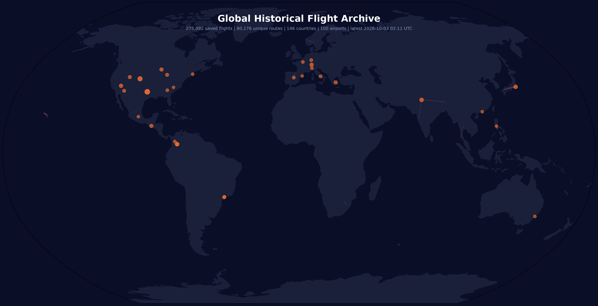
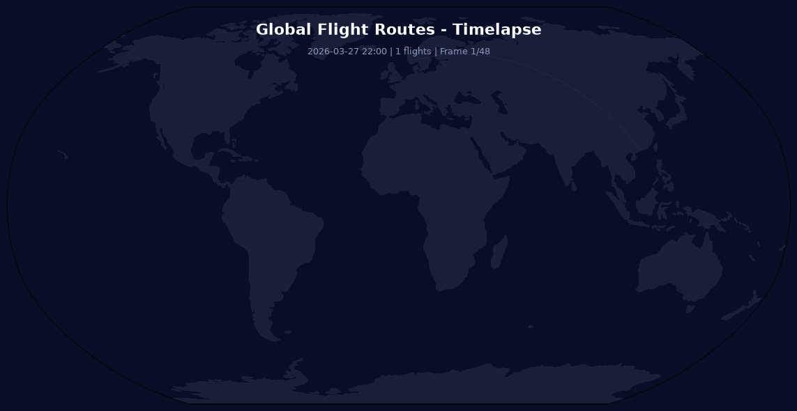

# Global Air Traffic Tracker

## About

Historical archive of saved air traffic routes collected from the [OpenSky Network](https://opensky-network.org/) API. This repository keeps appending completed flights to `data/flights/` and rebuilds the visuals from the full archive.

**Data Source:** Saved route files in `data/flights/` (originally fetched from OpenSky `/flights/all`)

**Update Frequency:** Every 5 minutes via GitHub Actions

**How it works:**
- Fetches recently completed routes from OpenSky
- Saves each route as a JSON file in `data/flights/`
- Rebuilds aggregate statistics from all saved historical routes
- Generates a historical route map and archive summary
- Generates daily reports, weekly leaderboards, and timelapse GIFs

## Route Timelapse

## Archive Snapshot

**Latest saved flight:** 2026-10-04 18:04:45 UTC
**Archive range:** 2026-03-27 22:00:26 UTC to 2026-10-04 18:04:45 UTC

- **276,323** saved flights
- **80,399** unique routes
- **146** countries touched by saved routes
- **100** airports in the archive
- **50** airlines identified
- **276,323** saved routes in the archive
- **1h 14m** average flight duration

### Carbon Footprint Estimate

- **3,344,894.2 tonnes** estimated CO2 emissions
- **193,906,911 km** total distance flown
- **863 km** average flight distance
*Based on ICAO avg: 115g CO2/passenger-km, ~150 passengers*

## Top Airlines

| # | Airline | Aircraft |
|---:|---------|--------:|
| 1 | Ryanair | 10829 |
| 2 | SkyWest Airlines | 9609 |
| 3 | EJA | 5418 |
| 4 | IndiGo | 4611 |
| 5 | American Airlines | 4273 |
| 6 | Southwest Airlines | 4057 |
| 7 | Delta Air Lines | 3431 |
| 8 | ENY | 3227 |
| 9 | LATAM Airlines | 2677 |
| 10 | AZU | 2600 |
| 11 | Vueling | 2289 |
| 12 | WIF | 2249 |
| 13 | LXJ | 2186 |
| 14 | Lufthansa | 2077 |
| 15 | easyJet | 1833 |
| 16 | Swiss International | 1806 |
| 17 | QLK | 1778 |
| 18 | EJU | 1720 |
| 19 | AXM | 1694 |
| 20 | United Airlines | 1682 |
| 21 | Alaska Airlines | 1629 |
| 22 | All Nippon Airways | 1577 |
| 23 | PGT | 1554 |
| 24 | GLO | 1541 |
| 25 | WMT | 1536 |
| 26 | Air France | 1521 |
| 27 | VIV | 1515 |
| 28 | Wizz Air | 1493 |
| 29 | CXK | 1365 |
| 30 | AEE | 1314 |

## Top Countries (by route endpoints)

| # | Country | Flights |
|---:|---------|--------:|
| 1 | 🇺🇸 US | 230560 |
| 2 | 🇪🇸 ES | 17278 |
| 3 | 🇧🇷 BR | 16230 |
| 4 | 🇦🇺 AU | 15919 |
| 5 | 🇨🇦 CA | 15389 |
| 6 | 🇮🇹 IT | 14902 |
| 7 | 🇮🇳 IN | 14589 |
| 8 | 🇩🇪 DE | 13200 |
| 9 | 🇨🇴 CO | 12834 |
| 10 | 🇬🇧 GB | 12727 |
| 11 | 🇫🇷 FR | 10925 |
| 12 | 🇯🇵 JP | 10523 |
| 13 | 🇹🇷 TR | 8343 |
| 14 | 🇬🇷 GR | 7920 |
| 15 | 🇲🇽 MX | 7632 |
| 16 | 🇨🇭 CH | 7336 |
| 17 | 🇳🇴 NO | 6817 |
| 18 | 🇹🇭 TH | 4958 |
| 19 | 🇲🇾 MY | 4588 |
| 20 | 🇿🇦 ZA | 4576 |
| 21 | 🇵🇱 PL | 4516 |
| 22 | 🇳🇿 NZ | 3922 |
| 23 | 🇵🇭 PH | 3652 |
| 24 | 🇬🇹 GT | 3467 |
| 25 | 🇭🇷 HR | 3141 |
| 26 | 🇰🇷 KR | 3106 |
| 27 | 🇲🇦 MA | 2726 |
| 28 | 🇲🇪 ME | 2593 |
| 29 | 🇳🇱 NL | 2464 |
| 30 | 🇮🇩 ID | 2283 |

## Busiest Airports (departures + arrivals across archive)

| # | Airport | City | Country | Flights |
|---:|---------|------|---------|--------:|
| 1 | Dallas-Fort Worth International Airport |  | US | 5600 |
| 2 | Denver International Airport |  | US | 4507 |
| 3 | Indira Gandhi International Airport |  | IN | 3293 |
| 4 | Tokyo International Airport |  | JP | 3156 |
| 5 | El Dorado International Airport |  | CO | 3072 |
| 6 | Harry Reid International Airport |  | US | 2977 |
| 7 | Zurich Airport |  | CH | 2869 |
| 8 | Guaymaral Airport |  | CO | 2854 |
| 9 | Minneapolis-St Paul International/Wold-Chamberlain Airport |  | US | 2762 |
| 10 | La Aurora Airport |  | GT | 2637 |
| 11 | Eleftherios Venizelos International Airport |  | GR | 2635 |
| 12 | Salt Lake City International Airport |  | US | 2455 |
| 13 | Congonhas Airport |  | BR | 2359 |
| 14 | Chicago O'Hare International Airport |  | US | 2329 |
| 15 | Phoenix Sky Harbor International Airport |  | US | 2265 |
| 16 | Capua Airport |  | IT | 2149 |
| 17 | Madrid Barajas International Airport |  | ES | 2127 |
| 18 | Guarulhos - Governador Andre Franco Montoro International Airport |  | BR | 2110 |
| 19 | Frankfurt am Main International Airport |  | DE | 2077 |
| 20 | Charles de Gaulle International Airport |  | FR | 1960 |
| 21 | Enrique Olaya Herrera Airport |  | CO | 1959 |
| 22 | Hartsfield/Jackson Atlanta International Airport |  | US | 1959 |
| 23 | Malpensa International Airport |  | IT | 1950 |
| 24 | Sydney Kingsford Smith International Airport |  | AU | 1929 |
| 25 | General Edward Lawrence Logan International Airport |  | US | 1841 |
| 26 | Macau International Airport |  | MO | 1799 |
| 27 | Ninoy Aquino International Airport |  | PH | 1797 |
| 28 | Charlotte/Douglas International Airport |  | US | 1723 |
| 29 | Atizapan De Zaragoza Airport |  | MX | 1717 |
| 30 | Barcelona International Airport |  | ES | 1702 |
| 31 | Viracopos International Airport |  | BR | 1656 |
| 32 | Kuala Lumpur International Airport |  | MY | 1645 |
| 33 | Norman Y Mineta San Jose International Airport |  | US | 1626 |
| 34 | Seattle-Tacoma International Airport |  | US | 1625 |
| 35 | Calgary International Airport |  | CA | 1570 |
| 36 | Don Mueang International Airport |  | TH | 1562 |
| 37 | Oslo Gardermoen Airport |  | NO | 1549 |
| 38 | Vancouver International Airport |  | CA | 1547 |
| 39 | Bengaluru International Airport |  | IN | 1543 |
| 40 | Reno/Tahoe International Airport |  | US | 1500 |

## Top Routes (all saved history)

| # | From | To | Flights | Avg Duration | Distance | CO2 |
|---:|------|-----|--------:|------------:|--------:|----:|
| 1 | Guaymaral Airport (SKGY) | Guaymaral Airport (SKGY) | 1134 | 24m | - | - |
| 2 | Daniel K Inouye International Airport (PHNL) | Upolu Airport (PHUP) | 1042 | 21m | 244 km | 4,387.6 t |
| 3 | Enrique Olaya Herrera Airport (SKMD) | Enrique Olaya Herrera Airport (SKMD) | 767 | 8m | - | - |
| 4 | Ninoy Aquino International Airport (RPLL) | Wasig Airport (RPVL) | 698 | 24m | 225 km | 2,707.9 t |
| 5 | Tokyo International Airport (RJTT) | Hofu Airport (RJOF) | 698 | 1h 6m | 770 km | 9,272.4 t |
| 6 | La Aurora Airport (MGGT) | La Aurora Airport (MGGT) | 614 | 12m | - | - |
| 7 | Don Mueang International Airport (VTBD) | Surat Thani Airport (VTSB) | 461 | 44m | 555 km | 4,414.3 t |
| 8 | Madrid Barajas International Airport (LEMD) | Vitoria/Foronda Airport (LEVT) | 444 | 27m | 275 km | 2,103.9 t |
| 9 | Indira Gandhi International Airport (VIDP) | Yongphulla Airport (VQ10) | 437 | 1h 50m | 1,423 km | 10,724.7 t |
| 10 | Oslo Gardermoen Airport (ENGM) | Sogndal Airport (ENSG) | 424 | 44m | 241 km | 1,761.2 t |
| 11 | Eleftherios Venizelos International Airport (LGAV) | Santorini Airport (LGSR) | 395 | 24m | 218 km | 1,488.1 t |
| 12 | VGZR (VGZR) | Shah Amanat International Airport (VGEG) | 382 | 35m | - | - |
| 13 | Provo Municipal Airport (KPVU) | Nephi Municipal Airport (KU14) | 375 | 23m | 55 km | 356.4 t |
| 14 | O. R. Tambo International Airport (FAOR) | Newcastle Airport (FANC) | 371 | 21m | 250 km | 1,602.5 t |
| 15 | Kawaihapai Airfield (PHDH) | Kawaihapai Airfield (PHDH) | 354 | 12m | - | - |
| 16 | Bodø Airport (ENBO) | ENEN (ENEN) | 353 | 13m | - | - |
| 17 | Tokyo International Airport (RJTT) | Iwakuni Marine Corps Air Station (RJOI) | 348 | 1h 6m | 706 km | 4,236.9 t |
| 18 | La Aurora Airport (MGGT) | Coban Airport (MGCB) | 344 | 19m | 99 km | 589.2 t |
| 19 | Bergen Airport Flesland (ENBR) | Ørsta-Volda Airport Hovden (ENOV) | 343 | 26m | 215 km | 1,270.3 t |
| 20 | Indira Gandhi International Airport (VIDP) | Pune Airport (VAPO) | 337 | 1h 40m | 1,156 km | 6,723.0 t |
| 21 | Reykjavik Airport (BIRK) | Hveravellir Airport (BIHI) | 322 | 19m | 144 km | 801.0 t |
| 22 | El Dorado International Airport (SKBO) | Madrid Air Base (SKMA) | 321 | 18m | 14 km | 80.3 t |
| 23 | Suvarnabhumi Airport (VTBS) | Surat Thani Airport (VTSB) | 312 | 42m | 535 km | 2,881.5 t |
| 24 | El Dorado International Airport (SKBO) | Perales Airport (SKIB) | 312 | 14m | 114 km | 611.9 t |
| 25 | Congonhas Airport (SBSP) | Destilaria Medasa Airport (SJNQ) | 312 | 1h 14m | 961 km | 5,171.6 t |
| 26 | Tokyo International Airport (RJTT) | Saga Airport (RJFS) | 299 | 1h 25m | 910 km | 4,692.0 t |
| 27 | Cancun International Airport (MMUN) | Atizapan De Zaragoza Airport (MMJC) | 298 | 1h 50m | 1,304 km | 6,704.2 t |
| 28 | La Aurora Airport (MGGT) | Copan Ruinas Airport (MHRU) | 287 | 28m | 152 km | 750.0 t |
| 29 | Indira Gandhi International Airport (VIDP) | Pathankot Air Force Station (VIPK) | 275 | 44m | 431 km | 2,046.5 t |
| 30 | Harry Reid International Airport (KLAS) | Reno/Tahoe International Airport (KRNO) | 274 | 51m | 556 km | 2,626.5 t |

## Recent Flights

| Callsign | Airline | From | To | Departure | Arrival | Duration |
|----------|---------|------|-----|-----------|---------|----------|
| N81737 |  | Allentown Queen City Municipal Airport (KXLL) | Lancaster Airport (KLNS) | 2026-10-04 17:25 UTC | 2026-10-04 18:04 UTC | 39m |
| KLM877 | KLM Royal Dutch | Amsterdam Airport Schiphol (EHAM) | Chhatrapati Shivaji International Airport (VABB) | 2026-10-04 10:01 UTC | 2026-10-04 17:59 UTC | 7h 58m |
| N805FA |  | Santa Barbara Municipal Airport (KSBA) | Mineta San Jose International Airport (KSJC) | 2026-10-04 16:58 UTC | 2026-10-04 17:51 UTC | 53m |
| AIC4218 | Air India | Dubai International Airport (OMDB) | Chhatrapati Shivaji International Airport (VABB) | 2026-10-04 15:22 UTC | 2026-10-04 17:48 UTC | 2h 25m |
| SCU59 | SCU | Haskell Airport (K2K9) | Haskell Airport (K2K9) | 2026-10-04 17:34 UTC | 2026-10-04 17:44 UTC | 10m |
| N2733G |  | Addington Field (KEKX) | Addington Field (KEKX) | 2026-10-04 17:22 UTC | 2026-10-04 17:42 UTC | 19m |
| CXK1000 | CXK | Fort Worth Meacham International Airport (KFTW) | Austin-Bergstrom International Airport (KAUS) | 2026-10-04 16:15 UTC | 2026-10-04 17:39 UTC | 1h 24m |
| N737GK |  | North Las Vegas Airport (KVGT) | North Las Vegas Airport (KVGT) | 2026-10-04 17:18 UTC | 2026-10-04 17:39 UTC | 21m |
| N62422 |  | Palo Alto Airport (KPAO) | Palo Alto Airport (KPAO) | 2026-10-04 16:58 UTC | 2026-10-04 17:34 UTC | 35m |
| N29GB |  | Double Eagle Ii Airport (KAEG) | Double Eagle Ii Airport (KAEG) | 2026-10-04 17:19 UTC | 2026-10-04 17:32 UTC | 13m |
| N200KS |  | Anderson Field (KS97) | Lake Chelan Airport (KS10) | 2026-10-04 17:19 UTC | 2026-10-04 17:30 UTC | 10m |
| N166GH |  | Peter O Knight Airport (KTPF) | Peter O Knight Airport (KTPF) | 2026-10-04 17:25 UTC | 2026-10-04 17:28 UTC | 3m |
| N113FD |  | Mc Clellan Airfield (KMCC) | Cameron Park Airport (KO61) | 2026-10-04 17:17 UTC | 2026-10-04 17:27 UTC | 10m |
| N71560 |  | Barnard Airport (51KS) | Abilene Municipal Airport (KK78) | 2026-10-04 17:07 UTC | 2026-10-04 17:26 UTC | 19m |
| N262VA |  | Ogden-Hinckley Airport (KOGD) | Malad City Airport (KMLD) | 2026-10-04 16:43 UTC | 2026-10-04 17:24 UTC | 41m |
| SKW5447 | SkyWest Airlines | San Francisco International Airport (KSFO) | Cape Blanco State Airport (K5S6) | 2026-10-04 16:30 UTC | 2026-10-04 17:24 UTC | 53m |
| AIC1TA | Air India | Bengaluru International Airport (VOBL) | Chhatrapati Shivaji International Airport (VABB) | 2026-10-04 16:04 UTC | 2026-10-04 17:24 UTC | 1h 20m |
| N548LA |  | North Las Vegas Airport (KVGT) | Iron Mountain Pumping Plant Airport (72CL) | 2026-10-04 16:15 UTC | 2026-10-04 17:23 UTC | 1h 7m |
| N915NX |  | Santa Ynez/Kunkle Field (KIZA) | Mineta San Jose International Airport (KSJC) | 2026-10-04 16:37 UTC | 2026-10-04 17:22 UTC | 45m |
| CGNNP | CGN | Colonial Airport (NY24) | Colonial Airport (NY24) | 2026-10-04 15:40 UTC | 2026-10-04 17:20 UTC | 1h 40m |

---

